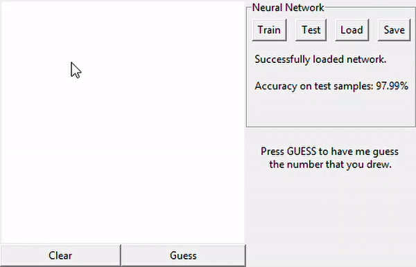

# Digit Recognizer

A Python 3 implementation of a feed-forward neural network trained with backpropagation and stochastic gradient descent to recognize handwritten digits. The algorithm is outlined in Michael Nielsen's book [Neural Networks and Deep Learning](http://neuralnetworksanddeeplearning.com/). Includes a GUI.

The training and testing examples are taken from the [MNSIT handwritten digit database](http://yann.lecun.com/exdb/mnist/).



## Getting Started

### Dependencies

* [Python 3](https://www.python.org/downloads/)
* tkinter (only required for the GUI, install with `pip install tkinter`)
* Pillow (only required for the GUI, install with `pip install pillow`)

### Installation

Clone the repository with:

`git clone https://github.com/davidtranhq/digit-classifier`

Alternatively, download a standalone Win10 64-bit executable [here](https://github.com/davidtranhq/digit-recognizer/releases)

## Build

The executable was built using [PyInstaller](https://pypi.org/project/PyInstaller/) and the command
`pyinstaller --onefile --windowed --icon=pencil.ico --hidden-import tkinter gui.py`


## Usage

To use a Python module:

Example (no gui):
```
>>> import mnist_loader
>>> import network
>>> training_data, eval_data, test_data = mnist_loader.load_all()
>>> layers = [784, 100, 10]
>>> net = Network(layers)
>>> net.train(training_data, 60, 10, 0.1, 5.0, eval_data)
>>> correct_answers = net.accuracy(test_data)
```

or

```
>>> python network.py
```

Example (using gui):
```
>>> python gui.py
```

A save and load feature is used to save and load previous network parameters in JSON file format. Included in the directory `SAVED_NETWORKS` is `98_accuracy_network.json` which contains network parameters that achieved 97.99% accuracy on the test data.

To use it, call `Network.load(file)` or `Network.save(file)` where `file` is an already open `_io.TextIOWrapper` (returned by `open()`)

## Details

* The cross-entropy cost function is used as the cost function
* The sigmoid function is used as the activation function for the neurons
* The network included was trained for 60 epochs on `training_data` with a mini batch size of 10, an initial learning rate of 0.1, and a regularization parameter of 5.0. The learning rate is automatically reduced as accuracy begins to fall on `evaluation_data`. The final accuracy is based on the results in `test_data`.
* `training_data` is the first 50000 examples from the MNIST training file, `evaluation_data` is the last 10000 examples from the same file, and `test_data` is the 10000 examples from the MNIST test file.


	


